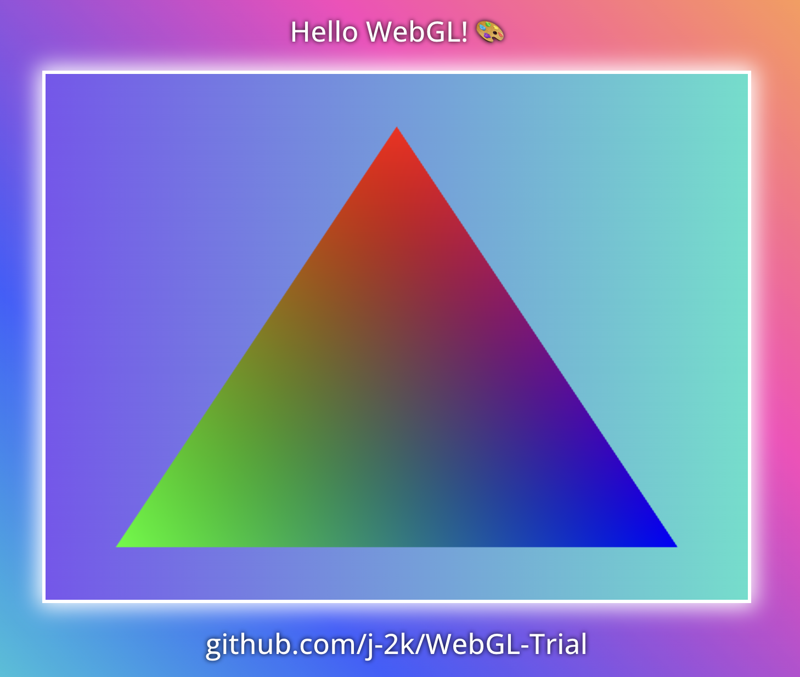
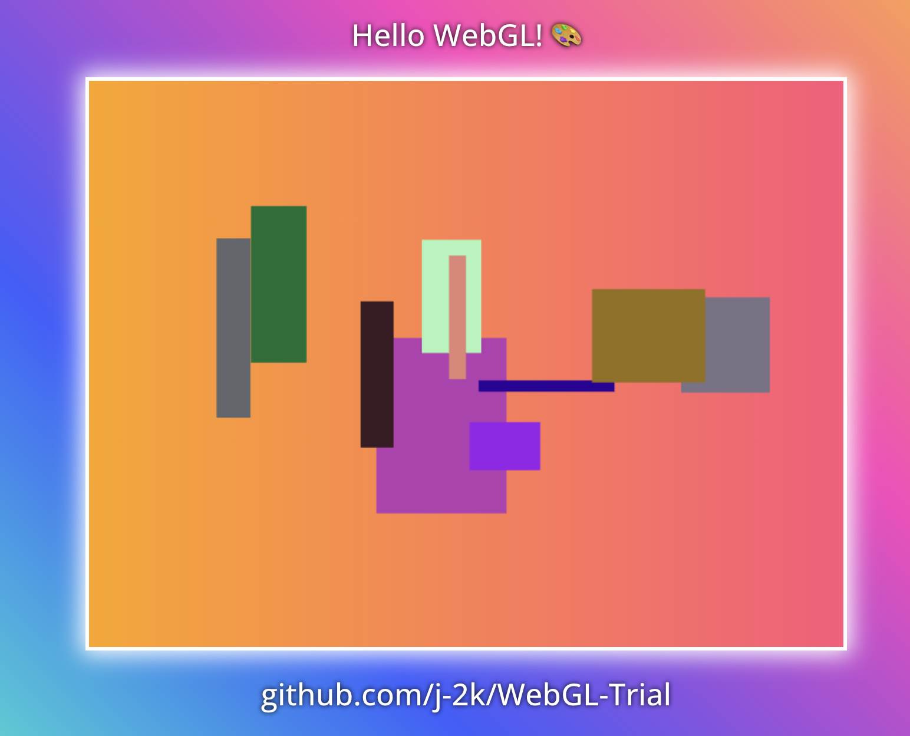
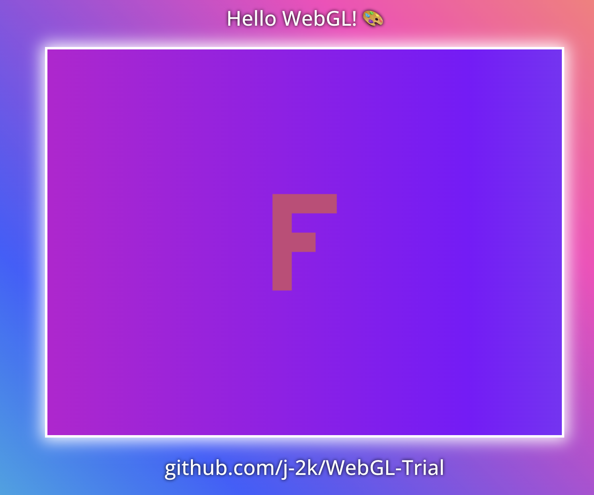
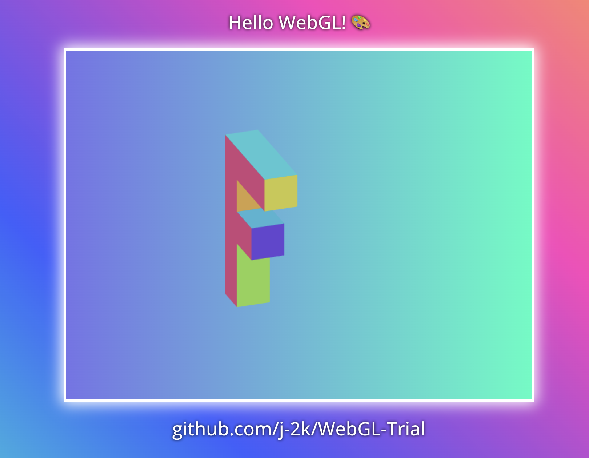

# ~~OpenGL_Trials_1~~ 
~~the first opengl project, it's time to do some proper graphics (Vulkan later).~~

# Learning WebGL
Additionally, I will learn a few JS/TS concepts over making a simple WebGL project, & important concepts below.
1. Stencil JS Project
2. Web Components API
3. Need to relearn important things related to web DOM & Components in a web project.

# Project Requirement Notes
- Have nodejs & npm
  1. Download nodejs & npm (nvm is better than using nodejs installer!)
    - nvm (use nvm to download nodejs!) > https://github.com/nvm-sh/nvm
    - nodejs (I suggest use nvm to install nodejs!) > https://nodejs.org/en
    - npm > https://docs.npmjs.com/downloading-and-installing-node-js-and-npm
  2. Check if you downloaded them properly by doing the below:
    - ```node -v```
    - ```npm -v```

# Building the project
1. Enter the correct directory WebGL-Trial/webgl-main
2. Install dependencies using ```npm i``` in your terminal
3. Run & start the project using ```npm run dev``` in terminal again
4. The website should automatically open on ```localhost:5173```! (Check the terminal incase its a different port! If it is taken Vite will automatically try the next available port.)

# My Platform, Versioning, & Dev environment
I will list what I used, just incase for anyone wondering what I used/platform choice to make this project.
- Mac (Sonoma 14) & Windows 10
- Visual Studio Code / Cursor
- npm version ```npm -v```  10.8.2
- node version ```node -v``` v20.17.0
- nvm version ```nvm -v``` 0.39.0

## Project Dependencies
  - **Typescript**
    - For obvious reasons.  
  - **Vite**
    - Vite fixed many issues I had previously.
  - **WebGL**
    - Make sure your browser/machine supports WebGL! 
  - *Old/Previous Packages (IGNORE THIS)*
    - Was using lite-server & watcher (replaced by vite).

## Guide to run Typescript code locally in VSC
***SKIP THIS IF YOU DONT CARE ABOUT COMPILING PURE TS CODE BY ITSELF!***
  1. Pre-pre-requsite note, please if you are on windows just use a cmdprompt terminal in VSC & not powershell, for some reason powershell was auto defaulted for me & it made things worse.
  2. Pre-requsites have nodejs & npm check by doing: 
       - mac/terminal > ```node -v && npm -v```
       - windows/powershell > ```node -v ; npm -v```
       - windows/cmdprompt > ```node -v && npm -v```
  3. Install typescript compiler globally via npm ```npm install -g typescript```
  4. Compile typescript code ```tsc filename.ts```
  5. Run compiled javascript code ```node filename.js```
     - ```tsc``` converts your TS to JS & ultimately we just run the JS file, you can do all this with just this 1 command that just merges the two together, check below:
       - mac/terminal > ```tsc filename.ts && node filename.js```
       - windows/powershell > ```tsc.cmd filename.ts ; node filename.js```
       - windows/cmdprompt > ```tsc filename.ts && node filename.js```

# Resources
- [MDN Docs](https://developer.mozilla.org/en-US/)
- [MDN Docs - Learn full web development from scratch](https://developer.mozilla.org/en-US/docs/Learn)
- [chatgpt.com](https://chatgpt.com/)
  - I'm going to use GPT to help me clarify shit while learning some of the topics below + I will need it especially when doing matrix multiplication & when I need an explanation on what happens when an object goes through 50 transformation calcs lmfao
- Important things to learn!
  - [stenciljs.com](https://stenciljs.com/)
  - [MDN Docs - Web Components](https://developer.mozilla.org/en-US/docs/Web/API/Web_components)
  - [MDN Docs - Web DOM](https://developer.mozilla.org/en-US/docs/Web/API/Document_Object_Model/Introduction)
  - [Awesome Web Components - Learn](https://github.com/web-padawan/awesome-web-components)
- WebGL Resources
  - [learnwebgl.brown37.net](https://learnwebgl.brown37.net/rendering/introduction.html)
  - [webglfundamentals.org](https://webglfundamentals.org/)
  - [MDN Docs - Web GL](https://developer.mozilla.org/en-US/docs/Web/API/WebGL_API/Tutorial/Getting_started_with_WebGL) This resource is insanely good (Just my personal opinion, above 2 are suggested heavily by seasoned graphics engineers!)
- WebGPU Resources (Advanced / Later on)
  - [LearnWebGPU](https://eliemichel.github.io/LearnWebGPU/)
  - [webgpufundamentals.org](https://webgpufundamentals.org/)
- JS/TS Resources
  - I heard MDN docs isn't "good" for learning JS/TS it's best for references, but they do have resources (I won't be listing them here!), I'm not sure of what is a popular good resource in this area (JS/TS) unlike my expertise in other fields but I will try to list what I have seen suggested by strong web developers in specializations I have delved into the past.
  - [learn-js](https://www.learn-js.org/) / [learn-ts](https://www.learn-ts.org/)
  - [Codecademy-js](https://www.codecademy.com/learn/introduction-to-javascript) / [Codecademy-ts](https://www.codecademy.com/learn/learn-typescript)
  - [freecodecamp/learn-js&ts](https://www.freecodecamp.org/learn/) I have seen this as popularly suggested as the above resource!
  - [typescriptlang.org-ts](https://www.typescriptlang.org/docs/) a very good website for typescript related docs & learning ts in general!
  - [theodinproject-js](https://www.theodinproject.com/) popular suggestions I have seen multiple times about learning javascript!
- Hosting Notes (Ignore):
  - Was looking into hosting services and found this, its a nice website! > https://wheretohostmy.app/free-tier-comparison
  - Used Netlify and it was really fast to setup. Just drag & drop the built project dist files into the host service & thats it! You can get the dist file by doing ```npm run build``` and the dist file will be created.
 
# Graphics Rendering Pipeline Process
Very important, I will write this out once I fully/almost understand everything in the pipeline.

# Learning Notes
Showcasing what I went through whilst learning WebGL!

Orthographic centering calculation - https://www.desmos.com/calculator/2dzuo1zxky

## Part 1 - Hello WebGL!


## Part 2 - Multiple Rectangles with double Triangles


## Part 2 - Math Overhaul using 2D Matricies + Orthographic Projection


## Part 3 - 3D Matrices + Prespective Projection + Depth Buffer + Backface Culling/Triangle Order


## 5

## 6
